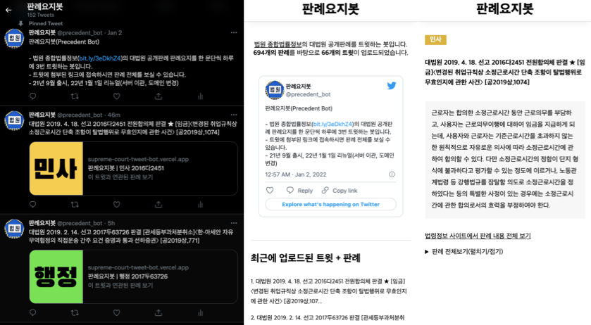

# 대법원 판례요지봇

 

**법원 종합법률정보의 대법원 공개판례의 요지 한 단락을 하루에 3번 트윗하는 봇**

2020.10 첫 릴리즈,  
2021.12.26 리뉴얼 작업 및 릴리즈

## 구현체

- 판례 트윗봇 : 하루 3번 판례를 트윗하는 트윗봇. 서버리스로 구현하고 스케쥴러 붙여 스케줄링.
- 판례 크롤러 : 대법원 법령정보 사이트 판례를 크롤링하여 Firebase Firestore에 저장하는 크롤러. 서버리스로 구현하고 스케쥴러 붙여 스케줄링.
- 판례 트윗 API : Firebase Firestore에 저장되어있는 데이터를 REST API 형태로 fetch할 수 있게 해주는 Express 서버리스 서버 
- 판례 조회 웹 클라이언트 : 판례 요지 정보를 볼 수 있는 웹 클라이언트
  - 판례 요지 단락이 글자제한이 있는 트윗으로 포스팅하기에는 길기 때문에, 주요 정보만을 트윗하고 판례 요지 단락 전문을 표시하는 웹 클라이언트가 필요했음

## v2.0.0에서의 개선

- 서버리스 이관 :  Express+PSQL 조합으로 EC2에 올려 서비스해왔으나, 과금이 꽤 많이 나와 Firebase Functions 서버리스로 API 서버 이관
- Next.js : 판례 조회 웹 클라이언트에 Next.js를 적용하여 컨텐츠 유형에 따른 동적 메타태그를 적용하고, ISR, 정적 페이지 생성 사용하여 페이지 로드 속도 개선
- 모바일 특화 디자인 : 모바일 트위터를 통해 유입되는 유저가 대다수이므로, 모바일에 특화된 UI 적용

## 데이터 출처

- [대한민국 법원 종합법률정보](https://glaw.scourt.go.kr/wsjo/intesrch/sjo022.do)
